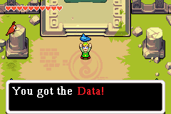
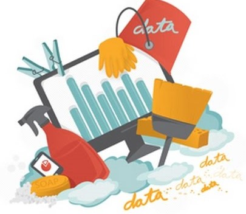
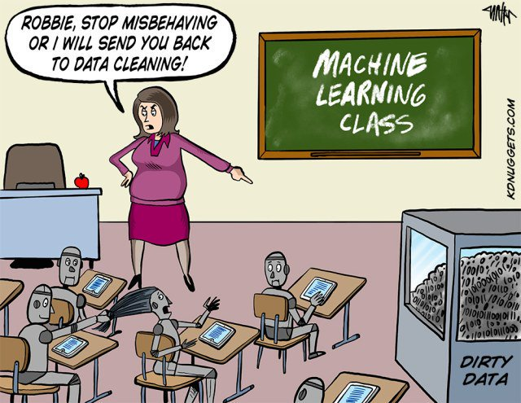

SDS M1-1: The Datascience Pipeline
================
Daniel S. Hain (<dsh@business.aau.dk>)

Introduction
============

So it shall beginn...
---------------------

> "Believe it or not, you are no different than Data. Put yourself into Data’s shoes and you’ll see why.""

Once upon a time there was a boy named Data. Throughout his life, he was always trying to understand what his purpose was. What values do I have? What impact can I make on this world? Where does Data come from? See any similarities between you and Data? These questions were always in his mind and fortunately, through sheer luck, Data finally came across a solution and went through a great transformation.

The Data Science Pipeline
=========================

It all started as Data was walking down the rows when he came across a weird, yet interesting, pipe. On one end was a pipe with an entrance and at the other end an exit. The pipe was also labeled with five distinct letters: “O.S.E.M.N.”. Curious as he was, Data decided to enter the pipeline. Long story short… in came data and out came insight.

Data soon realized: "You’re awesome. I’m awesome. Data Science is OSEMN!"". So, let's disect what happened in this OSEMN pipe.

-   **O:** Obtaining our data
-   **S:** Scrubbing / Cleaning our data
-   **E:** Exploring / Visualizing our data will allow us to find patterns and trends
-   **M:** Modeling our data will give us our predictive power as a wizard
-   **N:** Interpreting our data

**O:** Obtaining our data
-------------------------

First things first. Without data, no science.

### Objective:

-   Navigating through the vastness of data available on every given topic, including online and offline sources
-   Identifying the datasource (or combination of many) that suits best to answer your (research) question at hand
-   Retrieve and consolidate data from various sources to a dataformat suitable for your further workflow

### Skills Required:

-   Database Management: MySQL, PostgresSQL,MongoDB
-   Querying relational and non-relational databases
-   Accessing data via Application Programming Interfaces (API)
-   Retrieving Unstructured Data: text, videos, audio files, documents
-   Distributed Storage (Advanced): Hadoops, Spark/Flink
-   Python Packages
    -   XXX
-   R packages
    -   Dplyr
    -   API interfaces (eg. eurostat, rcrunchbase)
    -   rvest (web-scraping)
    -   sparklyr (Spark backend for R)
    -   mongolite (mongoDB backend for R)
    -   dbplyr (dplyr-integrated SQL backend for R)

**S:** Scrubbing / Cleaning our data
------------------------------------

So, we got all our data together. Yet, in most cases the really hard part begins. At the point where we can neathly run our Ml models, usually 80% of the job is done. Till then, Data has to go on a at times long and painful journey of missing value and outlier replacement, tidying, merging, mutating, aggregating and the like, just to emerge at its best.

### Objective:

-   Examine the data: understand every feature you’re working with, identify errors, missing values, and corrupt records
-   Clean the data: throw away, replace, and/or fill missing values/errors

### Skills Required:

-   Scripting language and corresponding packages: Python, R(dplyr)
-   Python Packages
    -   XXX
-   R packages
    -   Dplyr (as always, for general replacement, mutation, grouping, aggregation, joins)
    -   anomalize: Tidy anomaly detection
    -   VIM, amelia, mi, mice (missing value inputation)
-   Distributed Processing (Advanced): Hadoop, Map Reduce / Spark

**E:** Exploring / Visualizing our data
---------------------------------------

### Objective:

-   Find patterns in your data through visualizations and charts
-   Extract features by using statistics to identify and test significant variables

### Skills Required:

-   Python Packages
    -   Numpy
    -   Matplotlib
    -   Pandas
    -   Scipy
-   R Packages
    -   dplyr
    -   GGplot2 (Grammar of Graphics implementation in R)
    -   PerformanceanAlytics (Actually a finance package, but with many neath data inspection functions)
-   Descriptive & Inferential statistics
-   Data Visualization

**M:** Modeling our data
------------------------

> “Models are opinions embedded in mathematics” - Cathy O’Neil

### Objective:

-   In-depth Analytics: create predictive models/algorithms
-   Select appropriate model setups and choose model classes
-   Evaluate and refine the model

### Skills Required:

-   Machine Learning: Supervised/Unsupervised algorithms
-   Evaluation methods
-   ML libraries for Python
    -   Sci-kit Learn
-   ML libraries for R
    -   Caret
-   Linear algebra & Multivariate Calculus

**N:** iNterpreting our data
----------------------------

### Objective:

-   Identify business insights: return back to business problem
-   Visualize your findings accordingly: keep it simple and priority driven
-   Tell a clear and actionable story: effectively communicate to non-technical audience

### Skills Required:

-   Business Domain Knowledge
-   Data Visualization Tools:
    -   Tablaeu, MS PowerBI
-   Python DataViz Packages
    -   Matplotlib
    -   Seaborn
-   R DataViz Packages
    -   GGplot2
    -   Igraph (for network viz)
    -   Shiny (for interactive and online viz)
    -   Leaflet (for interactive maps)
-   Other stuff
    -   D3.JS, JavaScript general
-   Communication: Presenting/Speaking & Reporting/Writing

Conclusion
==========

> Remember, we’re no different than Data. We both have values, a purpose, and a reason to exist in this world.

In Summary, XXXXX

Most of the problems you will face are, in fact, engineering problems. Even with all the resources of a great machine learning god, most of the impact will come from great features, not great machine learning algorithms. So, the basic approach is:

-   Make sure you have a good data foundation
-   Make sure your pipeline is solid end to end
-   Start with a reasonable objective
-   Understand your data intuitively
-   Make sure that your pipeline stays solid
